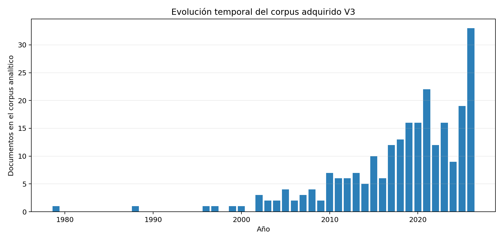
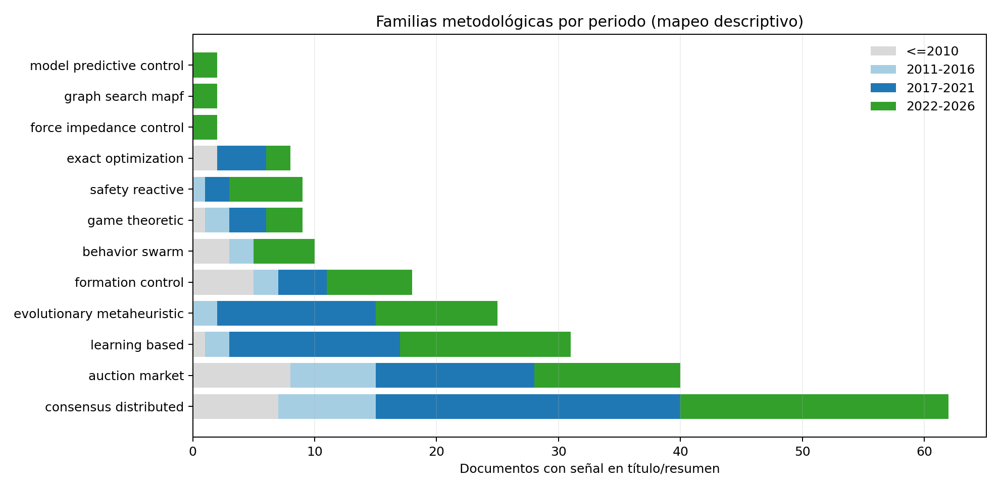

# De la asignación abstracta al transporte físico: revisión sistematizada y agenda de investigación para coaliciones heterogéneas de robots móviles

**Tipo de manuscrito:** revisión sistematizada de mapeo y síntesis crítica  
**Versión:** V3.0, corte de búsqueda y análisis: 13 de septiembre de 2026  
**Ámbito:** formación de coaliciones, asignación multirrobot, transporte cooperativo, comunicación, resiliencia y tráfico multicoalición  
**Estado editorial:** manuscrito avanzado para discusión; no se presenta como revisión sistemática exhaustiva ni como meta-análisis

## Resumen

La literatura sobre asignación de tareas multirrobot y transporte cooperativo ha crecido de forma sostenida, pero suele estudiar por separado tres decisiones que en una aplicación real son inseparables: qué robots forman una coalición, cómo esa coalición mueve físicamente una carga y cómo varias coaliciones comparten el espacio. Esta revisión sistematizada analiza esa fragmentación y extrae consecuencias de diseño para sistemas de robots móviles autónomos heterogéneos. Se ejecutó una cartera de 22 búsquedas derivadas de 16 familias conceptuales en Web of Science, Crossref, OpenAlex y arXiv, complementadas con fuentes abiertas y rastreo bibliográfico. El registro de descubrimiento reunió 3.014 identidades; 244 documentos adquiridos constituyeron el corpus analítico, 168 disponían de texto adecuado para lectura cercana y 20 estudios fueron verificados mediante fichas con localizadores. El mapeo de título y resumen identificó 115 señales de coalición/asignación, 15 de transporte físico y 20 de planificación/tráfico. Solo dos documentos combinaron SP1–SP2, diez SP1–SP3, ninguno SP2–SP3 y ninguno las tres interfaces. Las familias más frecuentes fueron consenso/distribución (62), subastas/mercados (40), aprendizaje (31), metaheurísticas evolutivas (25) y control de formación (18). No se obtuvo evidencia para declarar una familia “muerta”: las subastas redujeron su proporción temporal pero persistieron; los enfoques de enjambre reaparecieron reformulados; y teoría de juegos mantuvo un nicho pequeño. Las señales recientes de CBF, MPC, control de fuerza y MAPF son prometedoras pero escasas. La síntesis muestra que matching, equilibrio o consenso no certifican por sí mismos capacidad mecánica, seguridad ni factibilidad de tráfico. Se propone una arquitectura de evidencia en tres interfaces y un protocolo de comparación que combina oráculo MILP, mecanismos distribuidos, control físico y planificación de tráfico con métricas pareadas de utilidad, pose, wrench, seguridad, comunicación y recuperación.

**Palabras clave:** multi-robot task allocation; formación de coaliciones; robots heterogéneos; transporte cooperativo; sistemas distribuidos; control de formación; funciones de barrera; tráfico multirrobot; AMR.

## Abstract

Research on multi-robot task allocation and cooperative transport has expanded steadily, yet it often treats three operationally inseparable decisions as independent problems: which robots form a coalition, how that coalition physically moves a payload, and how multiple coalitions share the workspace. This systematized mapping review examines that fragmentation and derives design implications for heterogeneous autonomous mobile robot systems. A portfolio of 22 searches derived from 16 conceptual families was applied to Web of Science, Crossref, OpenAlex, and arXiv, supplemented by open sources and bibliographic tracing. The discovery registry contained 3,014 identities; 244 acquired documents formed the analytical corpus, 168 had adequate text for close reading, and 20 studies were verified through passage-localized evidence cards. Title-and-abstract mapping yielded 115 coalition/allocation signals, 15 physical-transport signals, and 20 planning/traffic signals. Only two documents connected SP1–SP2, ten connected SP1–SP3, none connected SP2–SP3, and none covered all three interfaces. The most frequent families were consensus/distributed methods (62), auctions/markets (40), learning-based methods (31), evolutionary metaheuristics (25), and formation control (18). The evidence did not support declaring any family “dead”: auctions declined proportionally but persisted; swarm methods reappeared in reformulated geometric-control roles; and game theory remained a small, persistent niche. Recent signals for control barrier functions, model predictive control, force control, and multi-agent path finding are promising but sparse. The synthesis shows that matching, equilibrium, or consensus alone cannot certify mechanical capacity, safety, or traffic feasibility. We propose a three-interface evidence architecture and a comparison protocol combining a MILP oracle, distributed mechanisms, physical control, and traffic planning with paired metrics for utility, pose, wrench, safety, communication, and recovery.

**Keywords:** multi-robot task allocation; coalition formation; heterogeneous robots; cooperative transport; distributed systems; formation control; control barrier functions; multi-robot traffic; autonomous mobile robots.

## Contribuciones de la revisión

Esta revisión aporta cinco resultados concretos:

1. una taxonomía integrada que distingue asignación estratégica, factibilidad física y tráfico, en lugar de agruparlas bajo la etiqueta genérica de “coordinación”;
2. un mapa temporal de familias metodológicas que evita confundir aparición de términos, persistencia y desaparición real;
3. un análisis de autores, comunidades, venues y aplicaciones limitado explícitamente al corpus adquirido;
4. una síntesis crítica de 20 estudios con evidencia localizada, incluyendo preprints arXiv y sus versiones de registro cuando se identificaron;
5. una agenda experimental directamente utilizable para un TFM sobre coaliciones distribuidas de AMR heterogéneos.

## 1. Introducción

La coordinación multirrobot se presenta con frecuencia como un único problema, pero una misión de transporte cooperativo contiene al menos tres mecanismos distintos. Primero, el sistema debe decidir qué robots atienden cada carga, si sus capacidades son suficientes, qué rol ocupa cada unidad y cuándo una coalición debe formarse, esperar, cambiar o disolverse. Segundo, los robots seleccionados deben aproximarse, establecer o preservar contacto, repartir movimiento o esfuerzo y llevar la carga a un destino sin violar restricciones. Tercero, robots libres, robots en reclutamiento y coaliciones físicamente acopladas deben compartir pasillos, intersecciones y recursos. Un resultado válido en una capa no se transfiere automáticamente a las otras.

La literatura de *multi-robot task allocation* (MRTA) dispone de taxonomías, métodos de mercado, optimización exacta, consenso y metaheurísticas. Las revisiones recientes muestran una cobertura amplia de técnicas de optimización y señalan como retos la asignación en línea, la incertidumbre, las restricciones cinemáticas y la evitación de colisiones (Chakraa et al., 2023). En paralelo, la literatura de transporte cooperativo distingue empuje, agarre y *caging*, modalidades cuyas condiciones de contacto y control no son intercambiables (Tuci et al., 2018). Una tercera línea estudia comunicaciones, plataformas y middleware, mostrando que la interpretación de un resultado depende de la arquitectura, el canal y la plataforma de validación (An et al., 2023).

La separación histórica de estas líneas ha producido algoritmos internamente sólidos pero externamente incompletos. Un matching perfecto puede asignar habilidades sin probar que la coalición produzca el wrench necesario. Un consenso de pose puede tener convergencia formal sin seleccionar la coalición correcta. Un controlador de carga puede evitar obstáculos sin resolver el conflicto entre varias coaliciones. Un plan de tráfico puede ser libre de colisiones para robots puntuales y resultar inviable para una carga rígida con gran huella y orientación limitada. Por ello, el objetivo de esta revisión no es enumerar algoritmos, sino determinar qué propiedad demuestra realmente cada familia, qué supuestos deja fuera y cómo deben conectarse las evidencias.

El problema es especialmente relevante para robots móviles autónomos heterogéneos. La heterogeneidad introduce ventajas potenciales —diferencias de capacidad, energía, sensor, movilidad o herramienta— y, a la vez, rompe equivalencias comunes. “Número suficiente de robots” no equivale a “capacidad suficiente”; “capacidad agregada” no implica compatibilidad geométrica; “factible en asignación” no implica “ejecutable con contacto”; y “distribuido” puede referirse a la decisión, al cómputo, a la comunicación o al despliegue físico. De Ryck et al. (2022), por ejemplo, muestran que una decisión descentralizada puede ejecutarse en una infraestructura físicamente compartida, una distinción que evita clasificaciones binarias engañosas.

Esta revisión se orienta por la siguiente pregunta: **¿qué mecanismos verificables permiten formar coaliciones heterogéneas de AMR, ejecutar transporte cooperativo físico y coordinar múltiples coaliciones con información local, y qué garantías, supuestos, baselines y límites están realmente demostrados?** La respuesta se organiza mediante tres subproblemas conectados: SP1, formación y asignación de coaliciones; SP2, ejecución y transporte físico; y SP3, planificación y tráfico de múltiples coaliciones. Comunicación, heterogeneidad, coste y resiliencia se tratan como ejes transversales.

## 2. Preguntas de investigación

La pregunta rectora se descompuso en siete preguntas operativas:

- **RQ1.** ¿Qué familias metodológicas dominan el corpus adquirido y cómo cambia su presencia temporal?
- **RQ2.** ¿Qué autores, grupos de coautoría y venues son recurrentes en este corpus?
- **RQ3.** ¿Qué aplicaciones y plataformas concentran la validación?
- **RQ4.** ¿Qué propiedades demuestran matching, subastas, juegos, consenso, metaheurísticas, MPC, CBF, control de formación y control de fuerza?
- **RQ5.** ¿Qué enfoques parecen haber perdido centralidad, cuáles persisten reformulados y cuáles aparecen recientemente?
- **RQ6.** ¿Qué evidencia conecta SP1, SP2 y SP3 en un mismo método o experimento?
- **RQ7.** ¿Qué diseño de método y protocolo experimental queda justificado para un sistema distribuido, interpretable y sin MARL como mecanismo principal?

## 3. Método

### 3.1 Diseño de la revisión

El estudio se define como **revisión sistematizada de mapeo y síntesis crítica**, con trazabilidad inspirada en PRISMA 2020 y PRISMA-S (Page et al., 2021; Rethlefsen et al., 2021). No se denomina revisión sistemática exhaustiva porque Web of Science quedó parcial, Google Scholar se usó de forma manual y la API de arXiv no completó todas las consultas de esta ejecución. Tampoco se realiza meta-análisis: los estudios difieren en robots, cargas, contacto, objetivos, escenarios, número de réplicas y métricas, por lo que no existe una medida de efecto común defendible.

El protocolo, criterios, queries, registros y manifiestos se congelaron antes de la síntesis final. Se mantuvieron tres niveles no intercambiables: descubrimiento bibliográfico; verificación de identidad y versión; y evidencia científica localizada en texto completo. Un término detectado en título o resumen se usa para mapeo descriptivo, nunca como prueba de implementación, superioridad o garantía.

### 3.2 Fuentes y cobertura

Se utilizaron Web of Science, Crossref y OpenAlex como fuentes principales de metadatos, arXiv para detección temprana y texto abierto, y páginas editoriales o repositorios para verificar versiones. Google Scholar se reservó para rastreo manual de versiones y citas, sin scraping ni incorporación de sus conteos como bibliometría. La ejecución abierta completó 44 consultas fuente–familia en Crossref/OpenAlex, produjo 1.044 filas y 898 identidades únicas por DOI o título. La consulta programática de arXiv registró 21 bloqueos de red y un límite de tasa; este fallo se conserva como estado de fuente y no se interpreta como ausencia de preprints.

Web of Science aportó 154 registros reconciliados. Las exportaciones F01 y F02 quedaron incompletas: faltan 30 y 225 registros respectivamente respecto del total mostrado, es decir, 255 registros en seis tramos. En consecuencia, los resultados no deben interpretarse como prevalencias universales ni como un censo cerrado del campo.

### 3.3 Estrategia de búsqueda

La cartera contiene 16 familias conceptuales, con ventanas primaria (2000–2026) y, cuando era pertinente, fundacional (1940–1999). Las 22 ejecuciones exactas fueron:

| Familia | Consulta exacta | Ventana |
| --- | --- | --- |
| F01 | `multi-robot coalition formation` | 2000–2026 |
| F02 | `heterogeneous multi-robot task allocation` | 2000–2026 |
| F03 | `game theoretic multi-robot task allocation` | 1940–1999; 2000–2026 |
| F04 | `distributed auction consensus multi-robot task allocation` | 2000–2026 |
| F05 | `multi-robot cooperative payload transport` | 1940–1999; 2000–2026 |
| F06 | `multi-robot shared load object transport` | 2000–2026 |
| F07 | `multi-robot non-prehensile transport caging pushing` | 1940–1999; 2000–2026 |
| F08 | `multi-robot wrench contact force feasibility payload` | 1940–1999; 2000–2026 |
| F09 | `distributed multi-robot formation docking cooperative transport` | 1940–1999; 2000–2026 |
| F10 | `decentralized leaderless multi-robot cooperative transport` | 1940–1999; 2000–2026 |
| F11 | `multi-robot coordination packet loss delay switching topology` | 2000–2026 |
| F12 | `multi-robot coalition failure recovery robot replacement transport` | 2000–2026 |
| F13 | `multi-robot traffic planning carried payload warehouse` | 2000–2026 |
| F14 | `multiple robot coalitions congestion coordination logistics` | 2000–2026 |
| F15 | `heterogeneous robot capability heterogeneous load coalition` | 2000–2026 |
| F16 | `heterogeneous distributed coalition cooperative payload failure recovery` | 2000–2026 |

Las consultas se diseñaron por interfaz y no como una cadena booleana única. Esta decisión reduce el riesgo de que una búsqueda muy restrictiva elimine artículos que estudian solo una capa, pero obliga a deduplicar y a no sumar resultados brutos como si fueran estudios independientes. La sintaxis y hashes de exportación se conservan en el [ledger de consultas](../data/query_ledger_v3.csv).

### 3.4 Inclusión, exclusión y unidad de análisis

Se incluyeron estudios con una contribución sustantiva a: formación/asignación de coaliciones; transporte cooperativo o control de contacto; planificación/tráfico multirrobot; o comunicación, fallos y heterogeneidad conectados con una decisión robótica. Se aceptaron artículos, actas, capítulos y revisiones con método identificable. Los preprints se marcaron y se enlazaron con su versión publicada cuando fue posible.

Se excluyeron trabajos sin relevancia multirrobot, sin conexión con las interfaces del TFM, puramente IoT o de agentes abstractos sin transferencia demostrada, y MARL como método principal cuando no proporcionaba un mecanismo white-box útil para comparación. La falta de acceso no se consideró exclusión temática: se registró como acceso pendiente y se prohibió usarla para afirmaciones de método, garantía o resultado.

La unidad del mapeo fue una identidad bibliográfica deduplicada. El registro de descubrimiento reunió 3.014 identidades: 2.309 semillas históricas y 898 identidades de descubrimiento abierto, con 193 solapamientos. De ellas, 244 contaban con un objeto adquirido legalmente y formaron el corpus analítico. La auditoría de adecuación detectó 168 textos aptos para lectura cercana —145 PDF y 23 HTML— y 76 objetos parciales, páginas de acceso o casos que requieren recuperación manual. Veinte fuentes prioritarias recibieron ficha de evidencia con página o sección.

### 3.5 Codificación y análisis

El mapeo automático usó exclusivamente título y resumen extraído localmente para asignar señales multietiqueta de tema, método, arquitectura, validación y aplicación. Las menciones en el cuerpo se guardaron por separado y no se contaron como implementación. La normalización agrupó variantes de venue y conservó autores como cadenas exactas; por ello, los conteos de autor pueden dividir a una misma persona si aparecen variantes del nombre.

Las familias metodológicas codificadas fueron: subasta/mercado, optimización exacta, teoría de juegos, metaheurística evolutiva, aprendizaje, comportamiento/enjambre, consenso/distribución, MPC, control de formación, fuerza/impedancia, seguridad reactiva/CBF y búsqueda de grafos/MAPF. Los periodos fueron ≤2010, 2011–2016, 2017–2021 y 2022–2026. Se reportan tanto conteos como proporción dentro de cada periodo; 2026 es un año incompleto.

Durante QA se detectó que páginas de paywall, recomendaciones editoriales y bibliografías podían inflar falsamente términos como “machine learning”. El extractor se corrigió para aceptar `Abstract` solo en la parte inicial del documento, detenerse antes de introducción, palabras clave, copyright o navegación de acceso, limitar el resumen a 350 palabras y eliminar la bibliografía del cuerpo. Ocho pruebas automatizadas verifican estas salvaguardas, la codificación multietiqueta, la normalización de venue y una corrección de año de versión de registro. Este episodio es metodológicamente relevante: una minería sin separación de secciones habría producido una narrativa temporal falsa.

### 3.6 Regla de interpretación

Los conteos describen el corpus adquirido, no “la totalidad del campo”. La lectura localizada permite afirmar lo que un artículo formula, prueba o reporta; no permite generalizarlo fuera de su escenario. Se aplicaron cuatro prohibiciones: no inferir optimalidad social desde un equilibrio; no inferir factibilidad mecánica desde matching o asignación; no inferir estabilidad global desde simulación; y no inferir escalabilidad desde un único tamaño grande o desde tiempo de CPU sin análisis de crecimiento.

## 4. Resultados

### 4.1 Crecimiento y composición del corpus

El corpus analítico contiene 244 documentos fechados entre 1979 y 2026, con un registro sin año. La curva es escasa antes de 2000, crece después de 2010 y se concentra a partir de 2017. El máximo de 2026 no debe leerse como crecimiento anual real: las búsquedas se ejecutaron en 2026, incorporaron literatura muy reciente y el corpus fue construido por relevancia, no por muestreo uniforme. La figura es, por tanto, un mapa de la colección y no una serie bibliométrica poblacional.

Las señales temáticas muestran una asimetría pronunciada. La coalición/asignación aparece en 115 documentos (47,1 %), comunicación o resiliencia en 79 (32,4 %), planificación/tráfico en 20 (8,2 %) y transporte físico en 15 (6,1 %). Setenta y dos documentos quedaron como contexto sin una señal específica suficiente. Como la clasificación es multietiqueta, los porcentajes no suman 100 %.

La asimetría no prueba que “no exista” investigación física; refleja, en parte, que MRTA es una etiqueta más estable y recuperable que el vocabulario fragmentado de manipulación, transporte, caging, formación y payload. Sin embargo, la lectura cercana confirma que la fragmentación no es solo terminológica. Las revisiones de MRTA se concentran en asignación y optimización (Chakraa et al., 2023), mientras que las de transporte organizan el campo por interacción física (Tuci et al., 2018) y las de comunicaciones/plataformas tratan la ejecución como un conjunto adicional de tecnologías (An et al., 2023).

### 4.2 Autores, comunidades y venues

Se analizaron 807 cadenas de autor exactas. Los autores más recurrentes fueron Farouq Zitouni y Ramdane Maamri (seis documentos cada uno), Saad Harous (cuatro), y, con tres, Ayan Dutta, Julie A. Adams, Sarvapali D. Ramchurn, Hamza Chakraa, François Guérin, Edouard Leclercq, Dimitri Lefebvre, Lantao Liu, Dylan A. Shell, Karl Tuyls, Lynne E. Parker, Elizabeth Sklar y Jonathan P. How. Estos conteos identifican recurrencia dentro del corpus; no constituyen un ranking de impacto, liderazgo o citación.

La red de coautoría sugiere cuatro núcleos útiles para navegar la literatura:

- **Zitouni–Maamri–Harous**, asociado en el corpus con asignación distribuida, CBBA, metaheurísticas y aplicaciones UAV;
- **Chakraa–Guérin–Leclercq–Lefebvre**, centrado en taxonomía y optimización de MRTA;
- **Liu–Shell**, vinculado a fundamentos de asignación y mecanismos de mercado;
- **Ramchurn–Farinelli–Jennings/Tarapore–Capezzuto**, conectado con formación de coaliciones, restricciones espaciotemporales y sistemas multiagente.

También aparece un núcleo Ferreira–Petrović–Orsag–Bogdan que enlaza planificación distribuida, heterogeneidad y dependencias entre calendarios. Este núcleo es particularmente valioso para SP1–SP3 porque formula asignación y scheduling en una misma representación (Ferreira et al., 2024), aunque no aborda contacto físico compartido.

Los venues más frecuentes fueron *IEEE Access* (23), *Journal of Intelligent & Robotic Systems* (20), *Autonomous Robots* (12), arXiv (10), *Sensors* (8), *Lecture Notes in Computer Science* (7) y *Frontiers in Robotics and AI* (6). La dispersión entre 117 venues confirma que el tema cruza robótica, control, optimización y sistemas multiagente. También explica por qué una sola base o un solo conjunto de palabras clave resulta insuficiente.

### 4.3 Taxonomía de enfoques

#### 4.3.1 Optimización exacta, matching y oráculos

La optimización exacta permite expresar restricciones explícitas y obtener un óptimo condicionado al modelo. Ramchurn et al. (2010) muestran que la formación de coaliciones con restricciones espaciales y temporales contiene un problema NP-hard; usan MIP para instancias pequeñas y heurísticas *anytime* para mayores. Guerrero et al. (2017) formulan coaliciones con plazos e interferencia y comparan una solución entera con subastas. En ambos casos, el valor del solver exacto es doble: resuelve instancias acotadas y produce una referencia contra la cual medir el coste de descentralizar.

El matching bipartito puede ofrecer complejidad favorable cuando las capacidades se reducen a compatibilidad robot–tarea. CF-HMRTA reporta una construcción de peor caso `O(|E|)` y ejemplos con 2.000 robots y 400 tareas, pero su propia delimitación es centralizada, estática y determinista (Verma et al., 2025). El resultado ilustra una frontera: un matching perfecto garantiza cobertura dentro del grafo construido, no fuerza, geometría, energía real, ausencia de colisiones ni optimalidad social.

La consecuencia metodológica es que el algoritmo húngaro solo es un baseline correcto para asignación uno-a-uno o para una reducción demostrada. Cuando una carga requiere capacidades acumuladas, varios robots simultáneos, roles o restricciones de contacto, el oráculo debe ser MILP/ILP, set partitioning, generalized assignment u otra formulación equivalente a la estructura real.

#### 4.3.2 Mercados, subastas y precios

Las subastas son la familia clásica más persistente. Su ventaja es convertir información privada —coste, ruta, capacidad o disponibilidad— en pujas y resolver conflictos sin enumerar toda la asignación. Liu y Shell (2013) prueban optimalidad global y complejidad fuertemente polinómica `O(n^3 log n)` para su problema de asignación estratégica uno-a-uno. Esa prueba es importante precisamente por su límite: no se extiende a tareas multirrobot o capacidades acumuladas.

Los trabajos posteriores incorporan estructura operacional. Zitouni et al. (2020) combinan CBBA y Ant Colony System en una aplicación UAV de rescate, midiendo makespan, distancia y mensajes. Mazdin y Rinner (2021) comparan comunicación periódica, por evento e híbrida durante formación y asignación de coaliciones bajo pérdida de mensajes. De Ryck et al. (2022) introducen restricciones de routing en las pujas de AGV industriales. En conjunto, estas variantes muestran que la subasta no murió: cambió de mecanismo genérico de asignación a componente que incorpora comunicación, congestión o búsqueda.

Su debilidad recurrente es que la utilidad suele ser un proxy de ejecución. Distancia, tiempo esperado o coste de ruta pueden anticipar parte de SP2/SP3, pero no certifican contacto, wrench o seguridad. Además, una subasta puede ser lógicamente descentralizada y depender de comunicación fiable para empates o consistencia; la arquitectura debe especificar quién calcula, quién conserva el estado y qué ocurre con mensajes tardíos.

#### 4.3.3 Juegos, coaliciones y dinámicas poblacionales

La teoría de juegos aparece en nueve títulos/resúmenes, una fracción pequeña pero persistente. Su utilidad no reside en “hacer óptimo” el sistema por definición, sino en representar decisiones locales, incentivos y cambios unilaterales de coalición. Los juegos potenciales permiten relacionar variaciones de payoff con una función global; los juegos coalicionales modelan valor conjunto; y las dinámicas poblacionales ofrecen mecanismos continuos o asíncronos para redistribuir participación.

El riesgo conceptual es sobreinterpretar el equilibrio. Un equilibrio de Nash no implica optimalidad social, factibilidad mecánica, ausencia de colisiones ni estabilidad del controlador. Para que un juego sea una contribución verificable debe declarar agentes, acciones, información, unidades de cada término de payoff y relación formal entre diferencias de utilidad y potencial. Además, debe demostrar que las acciones admisibles respetan capacidad y cierre de coalición, o delegar esa certificación a una capa explícita.

La baja frecuencia del rótulo “game theoretic” no significa irrelevancia. Muchas subastas, precios, valores de Shapley o mecanismos de intercambio usan ideas económicas sin presentarse como juegos. Varghese et al. (2026), por ejemplo, emplean agrupamiento basado en valor de Shapley dentro de un marco central multiobjetivo; esto no lo convierte automáticamente en juego distribuido. La taxonomía debe basarse en el mecanismo demostrado, no en una palabra aislada.

#### 4.3.4 Consenso y coordinación distribuida

Consenso/distribución es la señal más frecuente (62). Esta familia cubre objetos distintos: acuerdo de asignación, resolución de conflicto, consenso de estado, formación y estimación. Agruparlos sin distinguir la variable consensuada produce conclusiones vacías. CBBA consensúa ganadores y bundles; un controlador de formación consensúa pose o error; un estimador consensúa estado; y ninguno reemplaza a los otros.

Savino et al. (2020) proporcionan un ejemplo formal: el consenso de pose con cuaterniones duales converge bajo grafos dirigidos con árbol de expansión, y se aplica a manipuladores móviles. La misma fuente delimita que el seguimiento perfecto de un líder virtual dinámico queda fuera de la prueba. Mazdin y Rinner (2021), en cambio, estudian consenso de decisión y comunicación de coaliciones mediante simulación. Comparar ambos solo bajo la etiqueta “distributed” sería metodológicamente incorrecto.

La lección es separar cuatro dimensiones: descentralización de la decisión, distribución del cómputo, localidad de la información y despliegue del software. Un método puede ser descentralizado en lógica y ejecutarse en hardware común; otro puede ejecutarse en cada robot y requerir información global. “Sin coordinador central” tampoco significa “sin sincronización” ni “sin reloj”: cualquier implementación digital usa muestreo, temporizadores y políticas de actualización.

#### 4.3.5 Metaheurísticas evolutivas y aprendizaje

Las metaheurísticas evolutivas aparecen en 25 documentos. Son atractivas para problemas combinatorios con múltiples objetivos y restricciones que hacen costoso el solver exacto. Ferreira et al. (2024) usan una metaheurística distribuida con mimetismo e intercambio de conocimiento para asignación y scheduling con dependencias; Varghese et al. (2026) combinan NSGA-II con una agrupación central por Shapley para capacidad, energía, plazos, makespan y balance.

Estas técnicas producen soluciones útiles sin prueba general de optimalidad. Su evaluación debe incluir semilla, presupuesto de cómputo, dispersión, caso no convergente y comparación con un oráculo en instancias pequeñas. “Near-optimal” solo es defendible si se reporta gap frente a óptimo o cota. También es necesario separar el coste de búsqueda offline del tiempo de decisión operativo.

Los métodos de aprendizaje aparecen en 31 documentos y crecen después de 2017, pero esta señal mezcla clasificación, estimación, control y MARL. Para el problema objetivo, el aprendizaje puede ser habilitador —percepción, estimación de coste o modelo— sin ser la política principal de asignación. Esta separación conserva explicabilidad y facilita verificar restricciones. Una política MARL de extremo a extremo puede ser un comparador contextual, pero no sustituye un mecanismo white-box si no ofrece garantías o trazabilidad equivalentes.

#### 4.3.6 Control de formación, caging, MPC y fuerza

La literatura física requiere clasificar primero el modo de interacción. Tuci et al. (2018) separan empuje, agarre y caging. En caging, la variable esencial es el cierre geométrico alrededor del objeto; en agarre rígido o transporte prehensil importan transformaciones de contacto, wrench y tensión interna; en empuje aparecen fricción, pérdida de contacto y no holonomía del objeto. No es correcto compartir una única prueba de estabilidad entre estas modalidades sin un modelo común explícito.

TWINBOT demuestra una cadena física completa con dos I-AUV: detección, recogida, transporte y depósito mediante control cinemático descentralizado y comunicación submarina limitada (Pi et al., 2021). Tejada et al. (2025) combinan dos robots omnidireccionales, grippers blandos y control leader–follower para preservar caging, pero reconocen la ausencia de sensado de fuerza y la necesidad de escalar a más robots. Muhammed et al. (2026) avanzan hacia MPC no lineal descentralizado con dos AMR físicamente acoplados, ejecución a 10 Hz, RMSE inferior a 4 cm y comunicación por eventos; aun así, la evidencia se limita a dos robots.

Rao y Sundaram (2022) integran MPC centralizado y funciones de barrera exponenciales para una carga rígida suspendida de cuatro UAV en simulación. Su ablación muestra sensibilidad al ruido y una región donde la evitación se vuelve inestable, un resultado negativo más informativo que una etiqueta genérica de robustez. De Simone et al. (2026) muestran que pose, calibración relativa y tensión interna pueden estimarse con fusión visual–táctil y controlarse en dos manipuladores, aunque con estimador central y sin locomoción AMR.

Finalmente, Song et al. (2026) presentan el caso más cercano a una integración SP1–SP2: percepción local, campo de densidad, Voronoi centroidal y CBF producen reclutamiento y formación adaptativa alrededor de dos cargas de distinto tamaño. La contribución es conceptualmente relevante, pero sigue siendo un preprint de cinco páginas con integradores de primer orden, objetos circulares y validación simulada; masa, fuerza de contacto y hardware quedan pendientes.

#### 4.3.7 Tráfico, recursos y planificación conjunta

SP3 es menos visible y suele entrar por rutas, scheduling o contención. Palmer et al. (2018) modelan tiempos inciertos y recursos exclusivos, como intersecciones o cargadores, dentro del coste de asignación. De Ryck et al. (2022) incorporan información de routing a una subasta para anticipar retrasos y bloqueos. Ferreira et al. (2024) relacionan asignación y scheduling mediante una formulación tipo VRP con dependencias entre calendarios.

Estos trabajos muestran que planificar ruta después de asignar puede ser subóptimo o inviable: la congestión modifica el coste de la tarea y puede cambiar qué robot o coalición conviene seleccionar. Sin embargo, ninguno de los estudios verificados resuelve simultáneamente la huella orientada de una carga transportada, el contacto interno de la coalición y el tráfico de múltiples cargas. La literatura de MAPF/CBS aparece solo en dos títulos/resúmenes del corpus y no forma una base suficiente para afirmar una tendencia consolidada.

### 4.4 Evolución metodológica: persistencia, declive relativo y emergencia

La figura siguiente muestra conteos acumulados por periodo. Debe leerse junto con las proporciones de la tabla, porque los periodos contienen 35, 40, 79 y 89 documentos respectivamente.

| Familia | ≤2010 | 2011–2016 | 2017–2021 | 2022–2026 | Interpretación prudente |
| --- | ---: | ---: | ---: | ---: | --- |
| Consenso/distribución | 7 (20,0 %) | 8 (20,0 %) | 25 (31,6 %) | 22 (24,7 %) | Persistente; máximo relativo en 2017–2021 |
| Subasta/mercado | 8 (22,9 %) | 7 (17,5 %) | 13 (16,5 %) | 12 (13,5 %) | Declive proporcional, no desaparición |
| Aprendizaje | 1 (2,9 %) | 2 (5,0 %) | 14 (17,7 %) | 14 (15,7 %) | Expansión clara después de 2017 |
| Evolutiva/metaheurística | 0 | 2 (5,0 %) | 13 (16,5 %) | 10 (11,2 %) | Consolidación reciente, con menor cuota en el último periodo |
| Control de formación | 5 (14,3 %) | 2 (5,0 %) | 4 (5,1 %) | 7 (7,9 %) | Familia clásica que persiste |
| Comportamiento/enjambre | 3 (8,6 %) | 2 (5,0 %) | 0 | 5 (5,6 %) | Reaparición o relabeling; no “muerte” |
| Teoría de juegos | 1 (2,9 %) | 2 (5,0 %) | 3 (3,8 %) | 3 (3,4 %) | Nicho pequeño y estable |
| Seguridad reactiva/CBF | 0 | 1 (2,5 %) | 2 (2,5 %) | 6 (6,7 %) | Señal reciente creciente |
| Optimización exacta | 2 (5,7 %) | 0 | 4 (5,1 %) | 2 (2,2 %) | Recurrente como oráculo o comparador |
| MPC | 0 | 0 | 0 | 2 (2,2 %) | Emergente en este corpus; evidencia escasa |
| Fuerza/impedancia | 0 | 0 | 0 | 2 (2,2 %) | Emergente en este corpus; evidencia escasa |
| Búsqueda/MAPF | 0 | 0 | 0 | 2 (2,2 %) | Emergente en este corpus; evidencia escasa |

La pregunta “¿qué métodos murieron?” requiere una respuesta negativa y útil. No existe base para declarar muerta ninguna familia. Las subastas perdieron cuota relativa, pero siguen integrándose con consenso, metaheurísticas y routing. Los enfoques de comportamiento/enjambre no aparecen en 2017–2021 bajo el vocabulario usado y reaparecen en cinco documentos recientes; esto puede reflejar relabeling hacia autoorganización, campos, cobertura o CBF. La teoría de juegos no despegó como etiqueta dominante, pero mantiene presencia y se filtra en precios o valores cooperativos. La optimización exacta tampoco desaparece: cambia de aspiración operativa a oráculo, generador de cotas o solver para instancias pequeñas.

Las señales “nuevas” deben interpretarse con igual cuidado. CBF/seguridad reactiva alcanza seis documentos recientes y se integra con MPC o formación. MPC, control de fuerza y MAPF aparecen solo dos veces cada uno; son señales de frontera en esta colección, no prueba de emergencia global. La novedad más interesante no es una familia aislada, sino la composición de mecanismos: asignación + routing, percepción local + autoasignación + CBF, o MPC + comunicación por eventos.

### 4.5 Coocurrencia de métodos

La coocurrencia revela hibridación. Las combinaciones más frecuentes en título/resumen fueron subasta–consenso/distribución (18), consenso/distribución–aprendizaje (11), consenso/distribución–control de formación (8), consenso/distribución–metaheurística (5) y aprendizaje–seguridad reactiva (4). Estas cifras sugieren que las etiquetas simples describen cada vez peor los sistemas actuales.

No obstante, coocurrencia no implica integración fuerte. Un resumen puede mencionar aprendizaje para percepción y consenso para coordinación sin demostrar una interfaz formal entre ambos. La integración relevante exige definir qué variable sale de un módulo, con qué incertidumbre, frecuencia y unidad, y qué condición espera el siguiente. Bajo ese criterio, los estudios de lectura cercana muestran menos integración que la frecuencia textual.

### 4.6 Aplicaciones y madurez de validación

Las aplicaciones más frecuentes fueron búsqueda/rescate/exploración (33), UAV (27), almacén/logística (18), transporte/manipulación cooperativa (14), construcción/agricultura (11) y medio submarino (6). El dominio afecta el modelo: los UAV introducen carga suspendida y oscilación; los I-AUV, comunicación limitada y seis grados de libertad; los AGV, pasillos, intersecciones y cargadores; los manipuladores, wrench y tensión interna; los AMR terrestres, no holonomía, huella y contacto con el suelo.

La simulación aparece en 99 documentos, el experimento físico en 12, el análisis formal en siete y la señal de caso industrial en 25. Estos códigos son multietiqueta y descriptivos, pero la diferencia es suficiente para rechazar una narrativa de madurez homogénea. Un “caso de warehouse” puede ser un layout simulado; no equivale a despliegue industrial. Los estudios físicamente más sólidos de la lectura cercana se concentran en equipos de dos robots: TWINBOT (Pi et al., 2021), caging con grippers blandos (Tejada et al., 2025), MPC descentralizado de AMR acoplados (Muhammed et al., 2026) y manipulación visual–táctil (De Simone et al., 2026). La brecha de escala no es solo computacional: también es experimental.

### 4.7 La discontinuidad SP1–SP2–SP3

El resultado central del mapeo es la baja intersección entre interfaces. Solo dos documentos muestran señal simultánea SP1–SP2 y diez SP1–SP3; ninguno muestra SP2–SP3 y ninguno las tres. La clasificación textual puede omitir integraciones descritas con vocabulario diferente, pero la lectura de fuentes clave reproduce el patrón:

- MRTA/coalición formula quién hace qué, pero suele abstraer locomoción y contacto (Ramchurn et al., 2010; Guerrero et al., 2017; Verma et al., 2025).
- Transporte físico controla una coalición ya dada, normalmente de dos o cuatro robots (Pi et al., 2021; Tejada et al., 2025; Muhammed et al., 2026).
- Tráfico/routing asume robots individuales o tareas de un robot y no una carga físicamente compartida (Palmer et al., 2018; De Ryck et al., 2022; Ferreira et al., 2024).

Song et al. (2026) constituye una excepción parcial: recluta dinámicamente más agentes para objetos mayores y los organiza mediante CVT/CBF. Sin embargo, la capacidad se infiere de tamaño observado, no de una restricción mecánica explícita; no hay masa ni wrench; y el entorno no representa pasillos o múltiples coaliciones rígidas. La excepción confirma qué falta para una integración completa.

### 4.8 Síntesis de las fuentes verificadas

| Fuente | Capa y método | Evidencia útil | Límite que impide sobreafirmar |
| --- | --- | --- | --- |
| Ramchurn et al. (2010) | SP1; CFSTP, MIP y heurísticas | NP-hardness, espacio/tiempo y coaliciones dinámicas | Agentes abstractos; sin contacto ni tráfico físico |
| Liu & Shell (2013) | SP1; precios estratégicos | Óptimo y complejidad para asignación uno-a-uno | No coaliciones multirrobot |
| Guerrero et al. (2017) | SP1; ILP y subastas | Plazos, interferencia y gap empírico | La interacción física queda fuera |
| Tuci et al. (2018) | SP2; revisión | Taxonomía empuje–agarre–caging | Fuente secundaria; no garantiza control |
| Palmer et al. (2018) | SP1–SP3; coste bajo incertidumbre | Recursos exclusivos y timing aleatorio | No resuelve colisión ni transporte |
| Savino et al. (2020) | SP2; consenso de pose | Prueba bajo grafo dirigido con spanning tree | Seguimiento dinámico y retardos fuera de la prueba |
| Zitouni et al. (2020) | SP1; CBBA + ACS | Calidad, ruta y mensajes en 16 casos | UAV simulado; porcentajes no transferibles |
| Mazdin & Rinner (2021) | SP1/comunicación | Políticas periódica, por evento e híbrida | Solo simulación; sin contacto |
| Pi et al. (2021) | SP2; control descentralizado I-AUV | Cadena física completa en tanque | Dos vehículos; dominio submarino |
| Rao & Sundaram (2022) | SP2; MPC + ECBF | Modelo end-to-end y ablaciones de ruido/masa | Preprint; simulación centralizada |
| De Ryck et al. (2022) | SP1–SP3; subasta + routing | Congestión incorporada en la puja | Sin coalición física; sin garantía de deadlock |
| An et al. (2023) | transversal; revisión | Comunicación, plataformas y transporte | Fuente secundaria; no benchmark |
| Chakraa et al. (2023) | SP1; revisión de optimización | Taxonomía y límites de MRTA | No modela por sí misma SP2 |
| Ferreira et al. (2024) | SP1–SP3; VRP + CBM-pop | Precedencias y scheduling distribuidos | Tareas de un robot; evaluación simulada |
| Tejada et al. (2025) | SP2; caging + soft gripper | Experimentos con geometrías distintas | Dos robots; sin fuerza en lazo |
| Verma et al. (2025) | SP1; matching bipartito | Escala computacional por habilidades | Central, estático, sin factibilidad física |
| De Simone et al. (2026) | SP2; IESEKF y pose/fuerza | Tensión interna y fusión visual–táctil | Manipuladores; estimación central |
| Muhammed et al. (2026) | SP2; NMPC descentralizado | Hardware, 10 Hz y comunicación por evento | Dos AMR; sin formación de coalición |
| Varghese et al. (2026) | SP1; Shapley + NSGA-II | Comparador central multiobjetivo | Cinco robots simulados; sin fallos reales |
| Song et al. (2026) | SP1–SP2; densidad + CVT + CBF | Autoasignación local a dos cargas | Preprint; integrador, sin masa/fuerza/hardware |

Las fichas completas, con localizadores y usos prohibidos, están en el [directorio de lectura cercana](../close-read/README.md).

### 4.9 Qué aporta arXiv y cómo debe usarse

Diez documentos del corpus proceden de arXiv. Su valor principal es revelar líneas tempranas y facilitar texto completo, no aumentar artificialmente el nivel de evidencia. Cuatro se leyeron de forma localizada. Para Savino et al. y Ferreira et al. se identificaron versiones de registro posteriores, que se citan preferentemente. Rao y Sundaram (2022) y Song et al. (2026) se mantienen como preprints.

El aporte más reciente de arXiv es Song et al. (2026), porque une detección, reclutamiento, tamaño adaptativo de equipo, formación y transporte. Su debilidad —ausencia de masa, fuerza y hardware— es también una pista de investigación. Rao y Sundaram (2022) ofrece una capa de seguridad y control más física, pero centralizada y sin formación. Leídos juntos, ambos preprints muestran una complementariedad aún no demostrada: autoasignación local para elegir la coalición y un certificado dinámico para mantener la carga segura. Esa combinación es una hipótesis de diseño, no un resultado ya establecido.

## 5. Discusión

### 5.1 La unidad correcta no es el algoritmo, sino la cadena de certificados

El problema integrado puede representarse como una cadena de tres certificados. El certificado estratégico indica que una coalición satisface capacidades, roles, disponibilidad y utilidad. El certificado físico indica que esa coalición puede producir y preservar movimiento/contacto dentro de límites de actuador y seguridad. El certificado de tráfico indica que la huella de la coalición y su carga dispone de una trayectoria o política de paso compatible con otros usuarios. Si cualquiera de los tres falla, la tarea no es ejecutable aunque los otros dos sean válidos.

Esta lectura explica por qué los resultados de familias distintas no compiten necesariamente. MILP y matching responden a una pregunta estratégica; MPC, formación o fuerza responden a una pregunta dinámica; CBS, reservas o routing responden a una pregunta espacial-temporal. El objetivo científico no debería ser escoger una familia “ganadora”, sino especificar una interfaz verificable entre ellas y medir el coste de esa composición.

Una interfaz mínima de coalición debería transportar al menos: identificador de carga, miembros y roles; capacidad acumulada y margen; geometría y puntos de contacto; huella orientada; pose y velocidad admisibles; estimación de wrench o cierre; presupuesto de comunicación; y condición de liberación, sustitución o aborto. SP2 debe devolver a SP1/SP3 indicadores de factibilidad, saturación, pérdida de contacto y retraso. Sin este retorno, la asignación permanece ciega a la ejecución.

### 5.2 Asignación no es coalición, y coalición no es transporte

Tres reducciones deben evitarse. Primero, una tarea asignada a un robot no representa una tarea que exige varios robots simultáneos. Segundo, sumar capacidades escalares no captura roles complementarios ni geometría. Tercero, formar un conjunto de robots no define cómo se aproximan, conectan o reparten el esfuerzo.

Liu y Shell (2013) demuestran que un mecanismo de mercado puede ser óptimo bajo una estructura uno-a-uno. Verma et al. (2025) muestran gran escala computacional bajo matching de habilidades. Ramchurn et al. (2010) y Guerrero et al. (2017) incorporan coaliciones y restricciones más ricas, a costa de complejidad. Ninguno de esos resultados, por sí mismo, produce una ley de control. En la dirección contraria, Muhammed et al. (2026) controlan dos AMR acoplados en tiempo real, pero reciben una coalición fija. Esta separación constituye una oportunidad científica concreta: usar un mecanismo estratégico distribuido que solo proponga coaliciones y un filtro físico que las certifique o rechace antes de comprometer la tarea.

### 5.3 Centralizado y distribuido no forman una oposición binaria

El corpus contiene 102 señales de arquitectura distribuida/descentralizada y 56 centralizadas. La diferencia no autoriza a afirmar superioridad. Un oráculo central puede disponer de información global y ofrecer una cota de calidad; una arquitectura distribuida puede reducir puntos únicos de fallo y adaptarse localmente; una solución híbrida puede usar coordinación local durante ejecución y cómputo central para diagnóstico o replanificación lenta.

La comparación justa requiere declarar información y frecuencia. Si el oráculo recibe estado global perfecto, debe presentarse como techo y no como competidor arquitectónicamente equivalente. Si el método distribuido intercambia todos los estados en cada tick, su localidad es nominal. Si la comunicación es por eventos, deben medirse errores, bytes, latencia efectiva, pérdidas, desactualización y efecto en seguridad, no solo número de mensajes. Muhammed et al. (2026) y Mazdin y Rinner (2021) muestran dos usos distintos de comunicación por eventos —control físico y formación de coalición— que todavía necesitan validación conjunta.

### 5.4 Qué significa realmente escalabilidad

La palabra “escalable” aparece con significados incompatibles: complejidad asintótica, tiempo de CPU, tamaño máximo ejecutado, estabilidad numérica, mensajes, memoria o degradación de calidad. CF-HMRTA reporta 2.000 robots y 400 tareas en un problema central de matching (Verma et al., 2025); eso es evidencia de escala computacional para esa formulación, no de una flota física de 2.000 robots. Ramchurn et al. (2010) evalúan 20 agentes y 300 tareas con heurísticas; Ferreira et al. (2024) estudian benchmarks de planificación; los experimentos de transporte físico verificados usan principalmente dos robots.

Una afirmación completa de escalabilidad debe reportar al menos cuatro curvas: calidad o gap de utilidad frente a tamaño; CPU y memoria; mensajes o bytes; y tasa de factibilidad física/seguridad. Para transporte debe añadirse densidad espacial, tamaño de carga y número de coaliciones concurrentes. Sin estas dimensiones, escalar la asignación puede simplemente desplazar el cuello de botella hacia aproximación, contacto o tráfico.

### 5.5 La supuesta muerte de métodos clásicos

Los datos contradicen una narrativa lineal donde un paradigma reemplaza al anterior. Las subastas no fueron sustituidas por aprendizaje: persisten y se combinan con consenso, routing o metaheurísticas. El control de formación no desapareció: sirve como capa de ejecución y recibe formulaciones geométricas más ricas. Los enfoques de enjambre pueden cambiar de nombre hacia autoorganización, cobertura, CVT o campos. La optimización exacta pierde viabilidad operacional al crecer el problema, pero gana valor científico como oráculo. La teoría de juegos permanece minoritaria, quizá porque sus elementos se absorben en precios, Shapley o negociación sin conservar la etiqueta.

Por tanto, “método muerto” debería reservarse para una familia que deje de publicarse, no tenga aplicaciones ni reciba extensiones durante una ventana suficientemente larga y tras normalizar cambios terminológicos. Este corpus no satisface ese estándar para ninguna familia. Sí permite hablar de **desplazamiento de función**: métodos de mercado pasan de solución completa a mecanismo de asignación; exactos, de solver operativo a oráculo; enjambre, de comportamiento global a generador geométrico; aprendizaje, de política total a estimador o componente.

### 5.6 Hacia una contribución casi publicable del TFM

La contribución mejor sustentada por la revisión no es “un nuevo algoritmo de MRTA” aislado. Es una arquitectura distribuida y explicable que conecte los tres certificados mediante interfaces medibles. Una formulación defendible sería:

> Diseñar y evaluar un mecanismo distribuido, basado en payoffs locales y una estructura potencial o poblacional verificable, que reclute coaliciones heterogéneas; someter cada coalición a un certificado físico de capacidad/contacto; y retroalimentar a la decisión estratégica y al tráfico con márgenes de factibilidad, usando un oráculo central solo como referencia.

La frase debe conservarse como objetivo hasta completar pruebas y experimentos. La revisión solo muestra que esta integración está subrepresentada en el corpus adquirido; no demuestra que sea universalmente inédita.

## 6. Agenda de investigación y protocolo propuesto

### 6.1 Arquitectura recomendada

La arquitectura mínima contiene cinco módulos:

1. **Estado local y mensajes vecinales.** Cada robot mantiene pose, capacidad, energía, estado de compromiso, vecinos y estimación de carga. Los mensajes llevan versión y edad.
2. **Juego de formación de coaliciones.** Las acciones son unirse, permanecer, cambiar de rol, esperar o salir. El payoff combina valor de tarea, compatibilidad, viaje, comunicación, margen físico y congestión con unidades o normalización declaradas.
3. **Certificador físico.** Valida capacidad, geometría/contacto, límites de velocidad, margen de wrench o cierre y posibilidad de acoplamiento. Una coalición no se activa solo por suma de capacidades.
4. **Control de transporte.** Para el modo primario prehensil/soportado, regula pose de carga, velocidad común, contacto y reparto de esfuerzo. Para caging/empuje debe usarse otro modelo y otro certificado.
5. **Planificación/tráfico.** Reserva o negocia corredores para la huella completa de la coalición y retorna coste de congestión y retraso a SP1.

La transición entre estados no necesita una FSM global. Puede implementarse con activaciones suaves, eventos locales y temporizadores asíncronos, pero la ejecución digital debe declarar integrador, periodo de muestreo, timeouts y tratamiento de mensajes tardíos.

### 6.2 Baselines necesarios

| Nivel | Baseline mínimo | Qué compara | Qué no puede reclamar |
| --- | --- | --- | --- |
| SP1 pequeño | MILP/ILP o set partitioning | Factibilidad y gap de utilidad | Arquitectura distribuida justa |
| SP1 distribuido | CBBA/subasta o consenso validado | Tiempo, calidad y comunicación | Factibilidad de contacto |
| SP1 simple | Húngaro/matching | Solo reducción uno-a-uno demostrada | Coaliciones multirrobot |
| SP2 | Leader–follower o virtual structure | Error de pose y acoplamiento | Selección de coalición |
| SP2 restringido | MPC/CBF central o descentralizado | Restricciones, seguridad y tiempo real | Tráfico global sin modelo |
| SP2 fuerza | Reparto central de wrench/impedancia | Tensión interna y saturación | Optimalidad de asignación |
| SP3 | A*/Dijkstra o planificación priorizada | Ruta y makespan básico | Ausencia de conflicto multiagente completa |
| SP3 competitivo | CBS/ECBS, ORCA/RVO o CBF-QP según modelo | Conflicto, seguridad o throughput | Contacto físico si la carga se abstrae |
| Integrado | Oráculo central con información global | Techo de calidad end-to-end | Equidad arquitectónica |

### 6.3 Experimentos y métricas

Cada experimento debe usar instancias idénticas y semillas pareadas. El protocolo mínimo incluye:

- tamaños de flota y número de cargas crecientes;
- heterogeneidad controlada de capacidad, velocidad, energía y sensor;
- cargas con masa, geometría y requisitos de rol distintos;
- red con latencia, pérdida, alcance y mensajes desactualizados;
- pasillos, intersecciones y densidad creciente;
- fallos durante reclutamiento, acoplamiento y transporte;
- al menos una ablación del término de congestión, margen físico y política de comunicación;
- distribución, intervalo de confianza y fallos, no solo promedio.

Las métricas deben separarse por certificado:

| Certificado | Métricas primarias |
| --- | --- |
| Estratégico | factibilidad, utilidad social, gap al oráculo, tiempo de formación, churn de coalición |
| Físico | error de pose, residual de wrench, fuerza interna, pérdida de contacto, saturación, energía |
| Tráfico | makespan, throughput, espera, distancia mínima, conflictos, deadlocks |
| Comunicación | mensajes, bytes, latencia efectiva, edad de estado, pérdidas toleradas |
| Resiliencia | tiempo de detección, tiempo de sustitución, carga no entregada, degradación tras fallo |
| Cómputo | CPU, memoria, iteraciones, deadline misses y dispersión entre semillas |

### 6.4 Hipótesis verificables derivadas

La revisión permite formular, pero no confirmar, las siguientes hipótesis:

- **H1:** incluir un margen físico en el payoff reduce asignaciones estratégicamente atractivas pero físicamente inviables, a costa de utilidad nominal.
- **H2:** incorporar congestión en la decisión de coalición reduce makespan y bloqueos frente a asignar primero y enrutar después.
- **H3:** una política de comunicación por eventos conserva factibilidad con menos bytes que una política periódica dentro de un rango acotado de pérdida y latencia.
- **H4:** un mecanismo potencial/poblacional con restricciones locales ofrece menor calidad que el oráculo central en instancias pequeñas, pero degrada más suavemente en CPU y comunicación al crecer la flota.
- **H5:** la sustitución local tras fallo reduce tiempo de recuperación frente a disolver y recalcular globalmente, siempre que exista capacidad vecinal redundante.

Cada hipótesis requiere definición formal del efecto, dirección esperada, criterio de aceptación y prueba estadística o formal apropiada. Una simulación favorable no convierte H1–H5 en teoremas.

## 7. Amenazas a la validez

**Cobertura.** Web of Science quedó parcial y faltan 255 registros de F01/F02. No hubo acceso a Scopus. Google Scholar se usó manualmente y no como fuente cuantitativa. La API de arXiv no completó la cartera, aunque se conservaron diez preprints adquiridos. Por ello, no se afirma saturación ni exhaustividad.

**Sesgo de selección.** El corpus de 244 documentos está enriquecido deliberadamente para las interfaces del TFM y mezcla semillas históricas con descubrimiento nuevo. Sus proporciones no estiman prevalencia poblacional. El año 2026 está sobrerrepresentado por cercanía al corte y es incompleto como año natural.

**Codificación.** Las categorías masivas se derivan de título y resumen. El vocabulario puede producir falsos negativos por sinónimos o falsos positivos por mención contextual. Durante QA se detectó que páginas de paywall y listas de referencias inflaban artificialmente la señal de aprendizaje; el extractor se corrigió para aceptar solo resúmenes tempranos, detenerse ante introducción, keywords o paywall, y excluir bibliografía del cuerpo. Ocho pruebas automatizadas cubren estas salvaguardas.

**Desambiguación.** Los 807 autores son cadenas exactas. Variantes de iniciales, tildes y orden pueden dividir una persona; homónimos pueden fusionarse. Por ello, la sección de autores describe nodos recurrentes, no productividad o influencia.

**Nivel de evidencia.** Solo 20 trabajos recibieron lectura cercana. Los restantes 148 textos elegibles son una reserva de ampliación, y 76 requieren acceso o inspección. Los conteos no sustituyen lectura primaria. Las cifras cuantitativas se atribuyen al escenario original y no se combinan en meta-análisis.

**Versiones.** arXiv puede contener manuscritos anteriores o posteriores a la revisión por pares. Se identificaron versiones finales para Savino et al. (2020) y Ferreira et al. (2024); los datos del manuscrito no deben atribuirse a la versión de registro sin comprobar continuidad. Song et al. (2026) y Rao y Sundaram (2022) permanecen etiquetados como preprints.

**Revisor y automatización.** El cribado y la síntesis fueron realizados por un revisor humano asistido por herramientas y modelos de lenguaje. No se calculó acuerdo interrevisor. La automatización se limitó a deduplicación, priorización, extracción inicial, clasificación descriptiva y control de consistencia; las afirmaciones fuertes se redactaron desde pasajes localizados. Aun así, pueden persistir errores de interpretación y la versión sometida debe recibir revisión experta independiente.

## 8. Conclusiones

La literatura adquirida es rica en mecanismos de asignación y coordinación distribuida, pero mucho menos densa en la integración con transporte físico y tráfico. El hallazgo no es que falten algoritmos, sino que abundan garantías parciales: optimalidad para una abstracción, consenso para una variable, seguridad para una coalición fija o routing para robots individuales. La contribución pendiente es convertir esas garantías locales en una cadena end-to-end que pueda fallar de forma explícita y recuperable.

No se identificaron métodos legítimamente “muertos”. Las subastas persisten con menor cuota relativa y mayor especialización; la optimización exacta se consolida como oráculo; el enjambre reaparece bajo autoorganización geométrica; la teoría de juegos mantiene un nicho; y aprendizaje se expande como componente. Las señales recientes de CBF, MPC, control de fuerza y MAPF son prometedoras, aunque todavía escasas y con validación física limitada.

Para el TFM, la dirección más defendible es un mecanismo distribuido y white-box de formación de coaliciones conectado a un certificador físico y a un coste de tráfico. El método debe compararse con un oráculo central en instancias pequeñas, con subastas/consenso en SP1, con controladores de formación o MPC/CBF en SP2 y con planificación adecuada en SP3. El éxito debe medirse simultáneamente en utilidad, factibilidad mecánica, seguridad, comunicación, cómputo y recuperación. Solo esa validación permitiría transformar la brecha observada en una contribución publicable.

## Declaraciones

**Disponibilidad de datos y código.** El protocolo, ledger de consultas, corpus analítico, tablas, figuras, manifiesto y fichas se encuentran en `academic-review/literature-review-v3/`. El análisis se reproduce mediante `academic-review/scripts/analyze_v3_literature.py`.

**Financiación.** No se declaró financiación específica para esta revisión.

**Conflictos de interés.** El autor declara no tener conflictos de interés relacionados con la síntesis.

**Ética.** La revisión utiliza publicaciones y metadatos; no incluye participantes humanos ni animales.

**Uso de inteligencia artificial.** Se emplearon herramientas automatizadas y un modelo de lenguaje para deduplicación asistida, priorización, extracción preliminar, clasificación descriptiva, control de consistencia y apoyo de redacción. Las herramientas no fueron tratadas como fuente bibliográfica. Los resultados cuantitativos y afirmaciones fuertes se limitaron a registros reproducibles o pasajes verificados. El autor conserva responsabilidad por la revisión final, citas, interpretación y cumplimiento de la política editorial del destino.

## Referencias

An, X., Wu, C., Lin, Y., Lin, M., Yoshinaga, T., & Ji, Y. (2023). Multi-robot systems and cooperative object transport: Communications, platforms, and challenges. *IEEE Open Journal of the Computer Society, 4*, 23–36. https://doi.org/10.1109/OJCS.2023.3238324

Chakraa, H., Guérin, F., Leclercq, E., & Lefebvre, D. (2023). Optimization techniques for multi-robot task allocation problems: Review on the state-of-the-art. *Robotics and Autonomous Systems, 168*, 104492. https://doi.org/10.1016/j.robot.2023.104492

De Ryck, M., Pissoort, D., Holvoet, T., & Demeester, E. (2022). Decentral task allocation for industrial AGV-systems with routing constraints. *Journal of Manufacturing Systems, 62*, 135–144. https://doi.org/10.1016/j.jmsy.2021.11.012

De Simone, M., Costanzo, M., De Maria, G., & Natale, C. (2026). Cooperative object transport and assembly: Pose/force control by visual-tactile feedback. *IEEE Robotics and Automation Letters, 11*(4), 4315–4322. https://doi.org/10.1109/LRA.2026.3665445

Ferreira, B. A., Petrović, T., Orsag, M., Martínez-de Dios, J. R., & Bogdan, S. (2024). Distributed allocation and scheduling of tasks with cross-schedule dependencies for heterogeneous multi-robot teams. *IEEE Access, 12*, 74327–74342. https://doi.org/10.1109/ACCESS.2024.3404823

Guerrero, J., Oliver, G., & Valero, O. (2017). Multi-robot coalitions formation with deadlines: Complexity analysis and solutions. *PLOS ONE, 12*(1), e0170659. https://doi.org/10.1371/journal.pone.0170659

Liu, L., & Shell, D. A. (2013). Optimal market-based multi-robot task allocation via strategic pricing. In *Robotics: Science and Systems IX*. https://doi.org/10.15607/RSS.2013.IX.033

Mazdin, P., & Rinner, B. (2021). Distributed and communication-aware coalition formation and task assignment in multi-robot systems. *IEEE Access, 9*, 35088–35100. https://doi.org/10.1109/ACCESS.2021.3061149

Muhammed, I., Nada, A. A., & El-Hussieny, H. (2026). Real-time decentralized model predictive control for cooperative multi-robot object transport: Experimental validation. *Scientific Reports, 16*, 9824. https://doi.org/10.1038/s41598-026-41881-w

Page, M. J., McKenzie, J. E., Bossuyt, P. M., Boutron, I., Hoffmann, T. C., Mulrow, C. D., Shamseer, L., Tetzlaff, J. M., Akl, E. A., Brennan, S. E., Chou, R., Glanville, J., Grimshaw, J. M., Hróbjartsson, A., Lalu, M. M., Li, T., Loder, E. W., Mayo-Wilson, E., McDonald, S., ... Moher, D. (2021). The PRISMA 2020 statement: An updated guideline for reporting systematic reviews. *BMJ, 372*, n71. https://doi.org/10.1136/bmj.n71

Palmer, A. W., Hill, A. J., & Scheding, S. J. (2018). Modelling resource contention in multi-robot task allocation problems with uncertain timing. In *2018 IEEE International Conference on Robotics and Automation (ICRA)* (pp. 3693–3700). https://doi.org/10.1109/ICRA.2018.8460981

Pi, R., Cieślak, P., Ridao, P., & Sanz, P. J. (2021). TWINBOT: Autonomous underwater cooperative transportation. *IEEE Access, 9*, 37668–37684. https://doi.org/10.1109/ACCESS.2021.3063669

Ramchurn, S. D., Polukarov, M., Farinelli, A., Truong, N. C., & Jennings, N. R. (2010). Coalition formation with spatial and temporal constraints. In *Proceedings of the 9th International Conference on Autonomous Agents and Multiagent Systems* (pp. 1181–1188). https://dblp.org/rec/conf/atal/RamchurnPFTJ10

Rao, N., & Sundaram, S. (2022). Integrated decision control approach for cooperative safety-critical payload transport in a cluttered environment [Preprint]. *arXiv*. https://doi.org/10.48550/arXiv.2201.13033

Rethlefsen, M. L., Kirtley, S., Waffenschmidt, S., Ayala, A. P., Moher, D., Page, M. J., & Koffel, J. B. (2021). PRISMA-S: An extension to the PRISMA statement for reporting literature searches in systematic reviews. *Systematic Reviews, 10*, 39. https://doi.org/10.1186/s13643-020-01542-z

Savino, H. J., Pimenta, L. C. A., Shah, J. A., & Adorno, B. V. (2020). Pose consensus based on dual quaternion algebra with application to decentralized formation control of mobile manipulators. *Journal of the Franklin Institute, 357*(1), 142–178. https://doi.org/10.1016/j.jfranklin.2019.09.045

Song, J., Bai, Y., & Wakamiya, N. (2026). Cooperative transportation without prior object knowledge via adaptive self-allocation and coordination [Preprint]. *arXiv*. https://arxiv.org/abs/2602.19070

Tejada, J. C., Toro-Ossaba, A., López-Quintero, M. A., Rozo-Osorio, D., López-González, A., Hernández-Martínez, E. G., Góngora, M., & Bonet Cruz, I. (2025). Enhancing object manipulation and transportation in multi-robot systems with soft gripper integration and caging-based control. *Journal of Intelligent & Robotic Systems, 111*(3), 76. https://doi.org/10.1007/s10846-025-02263-y

Tuci, E., Alkilabi, M. H. M., & Akanyeti, O. (2018). Cooperative object transport in multi-robot systems: A review of the state-of-the-art. *Frontiers in Robotics and AI, 5*, 59. https://doi.org/10.3389/frobt.2018.00059

Varghese T., G., Kochuvila, S., Kumar, N., & Prasad, R. R. V. (2026). Hybrid coordination framework for centralized task allocation and execution in heterogeneous multi-robot systems. *IEEE Access, 14*, 61573–61595. https://doi.org/10.1109/ACCESS.2026.3680629

Verma, A., Gautam, A., Dutta, A., Shekhawat, V. S., & Mohan, S. (2025). CF-HMRTA: Coalition formation for heterogeneous multi-robot task allocation. *Journal of Intelligent & Robotic Systems, 111*(3), 81. https://doi.org/10.1007/s10846-025-02287-4

Zitouni, F., Harous, S., & Maamri, R. (2020). A distributed approach to the multi-robot task allocation problem using the consensus-based bundle algorithm and ant colony system. *IEEE Access, 8*, 27479–27494. https://doi.org/10.1109/ACCESS.2020.2971585
